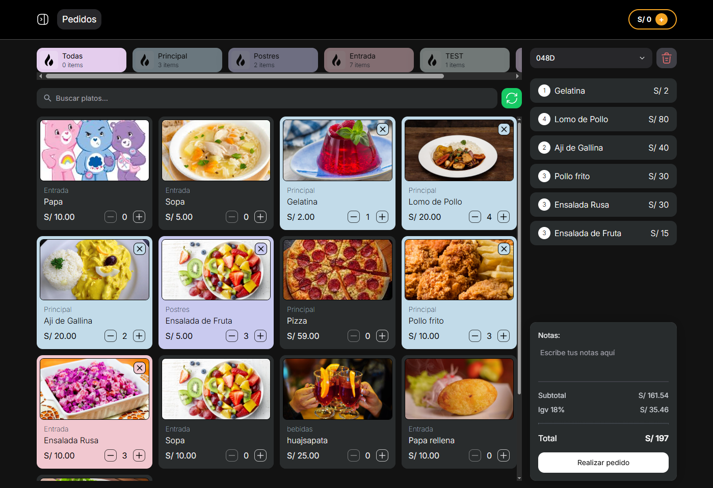
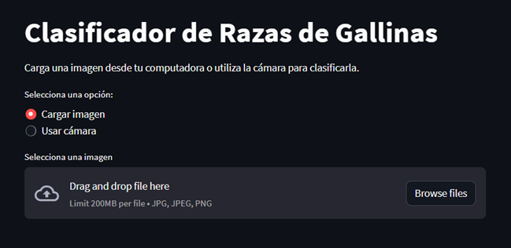

# Welcome to my GitHub profile!

Hello, my name is **_Victor_**, web developer passionate about data science. My goal is to combine both disciplines to create web applications that analyze real-time data and provide personalized recommendations through machine learning algorithms. I invite you to explore my projects. Thank you for visiting my profile

   
   

 

   
I'm a Software Engineer who loves building things—whether it's sleek and responsive front-end interfaces or powerful back-end systems. I work with tools like JavaScript, Python, R, Node.js, and Laravel to create full-stack web applications that are both efficient and user-friendly.

On the frontend, I focus on crafting beautiful, responsive designs using frameworks like React, and on the backend, I build robust systems with Node.js and Django. I also dive into the world of data science, applying machine learning and analytics to make data-driven decisions and create smarter solutions.

I’m always excited to take on new challenges, learn new things, and collaborate with others to turn ideas into real, functional projects. Let’s build something amazing together!

# My skills

- Programming languages: Python, R, C++, PHP, JavaScript, Java
- Data analysis: Power BI, Pandas, Numpy, Scikit-learn, Matplotlib, Seaborn
- Web development: HTML, CSS, Bootstrap, React, SASS, Tailwind, Django, Astro y Next.js
- Databases: SQL, Supabase, Firebase, MongoDB, MySQL, PostgreSQL.

<!-- * Machine Learning: Regresión, Clasificación, Agrupamiento, Redes neuronales
* Procesamiento de Lenguaje Natural (NLP): NLTK, Spacy
* Big Data: Hadoop, Spark -->

### Frontend

### Backend

### DevOps and others

### Data Science

 

|  | ,html>) |
| ---------------------------------------------------------------------------------------------------------------------------------- | ------------------------------------------------------------------------------------------------------------------------------------------------------------------------------- |

 

<a href`="#">`
  

# Mis proyetos

## 🌟 Proyectos Destacados

      <table>
        <tr>
          <td align="center" width="45%">
             
            <strong
              ><a href="https://fyrapos.software/"
                >POS SaaS para Restaurantes</a
              ></strong
            > 
            

              Sistema web en la nube para gestionar ventas, productos y mesas en
              restaurantes.
            

            
            
            
          </td>
          <td align="center" width="45%">
             
            <strong
              ><a href="https://github.com/valec3/clasificador_gallinas"
                >Clasificador de Gallinas con IA</a
              ></strong
            > 
            

              Modelo de visión por computadora para clasificar razas de gallinas
              usando CNN.
            

            
            
          </td>
        </tr>
      </table>
    

## Software Development

<table>
      <tr>
        <th>Proyecto</th>
        <th>Descripción</th>
        <th>Tecnologías</th>
      </tr>
      <tr>
        <td>
          <a href="https://pos-restaurant-knia.vercel.app/"
            >SmartPOS Restaurant</a
          >
        </td>
        <td>POS moderno para restaurantes con frontend</td>
        <td>
          
          
        </td>
      </tr>
      <tr>
        <td>
          <a href="https://github.com/valec3/odonto">Citas medicas</a>
        </td>
        <td>Gestor de citas médicas con autenticación y CRUD.</td>
        <td>
          
          
          
        </td>
      </tr>
      <tr>
        <td>
          <a href="https://chat-ai-gemini-pink.vercel.app/">Chat AI</a>
        </td>
        <td>Chatbot AI con integración de Gemini.</td>
        <td>
          
          
          
        </td>
      </tr>
      <tr>
        <td>
          <a href="https://github.com/valec3/Nike-web-clon"
            >Nike Landing Page</a
          >
        </td>
        <td>Clon responsivo del sitio oficial de Nike.</td>
        <td>
          
          
        </td>
      </tr>
      <tr>
        <td>
          <a href="https://github.com/valec3/TodoAppReact">Todo App React</a>
        </td>
        <td>Aplicación para gestionar tareas con React.</td>
        <td>
          
        </td>
      </tr>
      <tr>
        <td>
          <a href="https://github.com/valec3/YT-clone">Clon de YouTube</a>
        </td>
        <td>UI replicada de YouTube, usando componentes React.</td>
        <td>
          
        </td>
      </tr>
      <tr>
        <td>
          <a href="https://github.com/valec3/Python-Alien-Invasion"
            >Alien Invasion</a
          >
        </td>
        <td>Juego arcade en Pygame con animaciones y puntaje.</td>
        <td>
          
          
        </td>
      </tr>
      <tr>
        <td>
          <a href="https://github.com/valec3/methods_numeric"
            >Métodos Numéricos</a
          >
        </td>
        <td>Algoritmos matemáticos implementados desde cero.</td>
        <td>
          
        </td>
      </tr>
      <tr>
        <td>
          <a href="https://github.com/valec3/Game_py_Regletas_fraccionarias"
            >Regletas Fraccionarias</a
          >
        </td>
        <td>Juego educativo de fracciones para niños.</td>
        <td>
          
        </td>
      </tr>
    </table>

## 🐍 Ciencia de Datos

<table>
      <tr>
        <th>Proyecto</th>
        <th>Descripción</th>
        <th>Tecnologías</th>
      </tr>
      <tr>
        <td>
          <a href="https://github.com/valec3/clasificador_basura"
            >Clasificador de Basura</a
          >
        </td>
        <td>Clasificación automática de residuos reciclables.</td>
        <td>
          
          
        </td>
      </tr>
      <tr>
        <td>
          <a href="https://github.com/valec3/DATA-SCIENCE-PROJECTS">Análisis Titanic</a>
        </td>
        <td>Predicción de supervivencia en Titanic con ML clásico.</td>
        <td>
          
          
          
        </td>
      </tr>
    </table>
