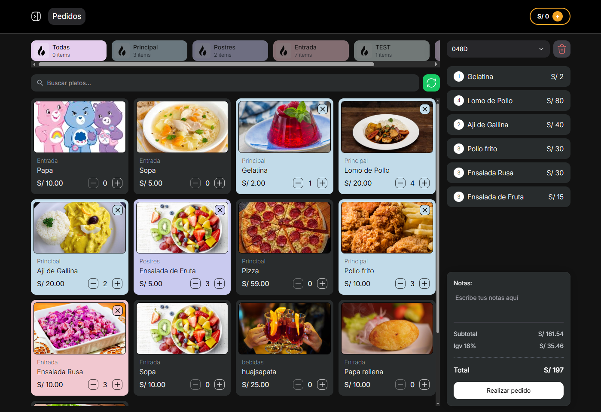
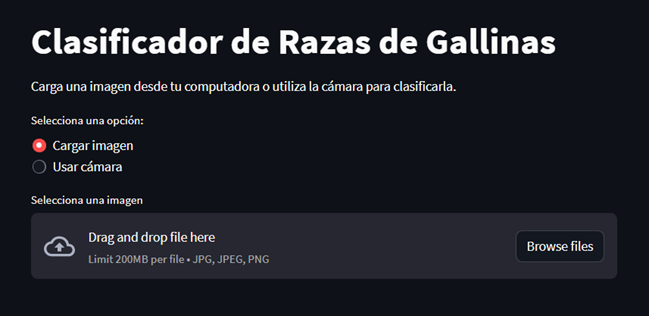

  

  <h1>Hi, I'm Victor 👋</h1>
  <h3>Software Engineer | Full-Stack, Cloud & HealthTech / FinTech Integrations</h3>

  

    Architecting production-grade web applications, scalable cloud microservices, and mission-critical integrations (HealthTech HL7/LIS & FinTech) backed by applied Machine Learning.
  

  

    
    
    
    
    
  

---

### 🚀 About Me

- 💻 **Full-Stack Engineering:** Specializing in reactive frontends and robust backends using **TypeScript, React, Next.js, Astro, and Node.js**.
- 🧠 **Applied AI & Data Science:** Designing and integrating Deep Learning and Machine Learning models using **Python, TensorFlow, Scikit-learn, and OpenCV**.
- 🏗️ **Architecture & Standards:** Strong advocate for clean architecture, SOLID principles, type safety, and resilient API design.
- 🎯 **Goal:** Delivering software products that solve real-world problems through data-driven decisions and modern interfaces.

---

### 🛠️ Core Tech Stack

#### 💻 Frontend & Mobile
<table>
  <tr>
    <td align="center" valign="top" width="100">
       
      <b>Next.js</b>
    </td>
    <td align="center" valign="top" width="100">
       
      <b>React</b>
    </td>
    <td align="center" valign="top" width="100">
       
      <b>React Native</b>
    </td>
    <td align="center" valign="top" width="100">
       
      <b>Angular</b>
    </td>
    <td align="center" valign="top" width="100">
       
      <b>Astro</b>
    </td>
    <td align="center" valign="top" width="100">
       
      <b>TypeScript</b>
    </td>
    <td align="center" valign="top" width="100">
       
      <b>Tailwind CSS</b>
    </td>
  </tr>
</table>

#### ⚙️ Backend & APIs
<table>
  <tr>
    <td align="center" valign="top" width="100">
       
      <b>NestJS</b>
    </td>
    <td align="center" valign="top" width="100">
       
      <b>Node.js</b>
    </td>
    <td align="center" valign="top" width="100">
       
      <b>Python</b>
    </td>
    <td align="center" valign="top" width="100">
       
      <b>FastAPI</b>
    </td>
    <td align="center" valign="top" width="100">
       
      <b>Express</b>
    </td>
    <td align="center" valign="top" width="100">
       
      <b>PHP</b>
    </td>
    <td align="center" valign="top" width="100">
       
      <b>Laravel</b>
    </td>
  </tr>
</table>

#### ☁️ Cloud & DevOps
<table>
  <tr>
    <td align="center" valign="top" width="100">
       
      <b>GCP</b>
    </td>
    <td align="center" valign="top" width="100">
       
      <b>AWS</b>
    </td>
    <td align="center" valign="top" width="100">
       
      <b>Docker</b>
    </td>
    <td align="center" valign="top" width="100">
       
      <b>Terraform</b>
    </td>
    <td align="center" valign="top" width="100">
       
      <b>Cloudflare R2</b>
    </td>
    <td align="center" valign="top" width="100">
       
      <b>CI/CD</b>
    </td>
    <td align="center" valign="top" width="100">
       
      <b>Linux</b>
    </td>
  </tr>
</table>

#### 🗄️ Databases & Storage
<table>
  <tr>
    <td align="center" valign="top" width="100">
       
      <b>PostgreSQL</b>
    </td>
    <td align="center" valign="top" width="100">
       
      <b>MySQL</b>
    </td>
    <td align="center" valign="top" width="100">
       
      <b>DynamoDB</b>
    </td>
    <td align="center" valign="top" width="100">
       
      <b>MongoDB</b>
    </td>
    <td align="center" valign="top" width="100">
       
      <b>Supabase</b>
    </td>
    <td align="center" valign="top" width="100">
       
      <b>Firebase</b>
    </td>
    <td align="center" valign="top" width="100">
       
      <b>Redis</b>
    </td>
  </tr>
</table>

#### 🧠 Data Science & Tools
<table>
  <tr>
    <td align="center" valign="top" width="100">
       
      <b>TensorFlow</b>
    </td>
    <td align="center" valign="top" width="100">
       
      <b>Scikit-Learn</b>
    </td>
    <td align="center" valign="top" width="100">
       
      <b>R Project</b>
    </td>
    <td align="center" valign="top" width="100">
       
      <b>Git</b>
    </td>
    <td align="center" valign="top" width="100">
       
      <b>GitHub</b>
    </td>
    <td align="center" valign="top" width="100">
       
      <b>Postman</b>
    </td>
    <td align="center" valign="top" width="100">
       
      <b>Figma</b>
    </td>
  </tr>
</table>

---

### 🌟 Featured Projects

  <table>
    <tr>
      <!-- FYRAPOS -->
      <td width="50%" valign="top">
        

          
          <h3>FYRAPOS — Restaurant Cloud SaaS</h3>
        

        

          Cloud-based point-of-sale and restaurant management platform. Streamlines table allocation, live order tracking, inventory, and automated sales analytics.
        

        

          
          
          
        

        

          🔗 <a href="https://fyrapos.software/"><strong>Live Application</strong></a>
        

      </td>
      <!-- Poultry Classifier -->
      <td width="50%" valign="top">
        

          
          <h3>AI Poultry Classifier (Computer Vision)</h3>
        

        

          Deep learning computer vision system trained on custom datasets. Employs Convolutional Neural Networks (CNNs) for real-time poultry breed classification and visual diagnosis.
        

        

          
          
          
        

        

          🔗 <a href="https://github.com/valec3/clasificador_gallinas"><strong>Source Code & Model</strong></a>
        

      </td>
    </tr>
    <tr>
      <!-- Gemini Chat AI -->
      <td width="50%" valign="top">
        

          <h3>Gemini AI Conversational Assistant</h3>
        

        

          Interactive generative AI conversational platform powered by Google's Gemini LLM. Implements real-time token streaming, prompt persistence, and responsive UI design.
        

        

          
          
          
        

        

          🔗 <a href="https://chat-ai-gemini-pink.vercel.app/"><strong>Live Demo</strong></a>
        

      </td>
      <!-- DentalCare Management -->
      <td width="50%" valign="top">
        

          <h3>DentalCare — Clinical Booking System</h3>
        

        

          Comprehensive medical appointment and clinical history management system. Features authenticated multi-role dashboards, schedule management, and CRUD operations.
        

        

          
          
          
        

        

          🔗 <a href="https://github.com/valec3/odonto"><strong>Source Code</strong></a>
        

      </td>
    </tr>
  </table>

---

### 📊 GitHub Activity & Statistics

  

